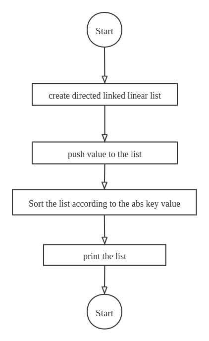

## 程序框图

## 程序
list_direct_linked_linear_list.c
list_direct_linked_linear_list.h
list_init.c
list_init.h
variant_8.c

## 结果
1 -> 5 -> 2 -> 3 -> -1 -> -5 -> -2 -> -3
1 -> -1 -> 2 -> -2 -> 3 -> -3 -> 5 -> -5

